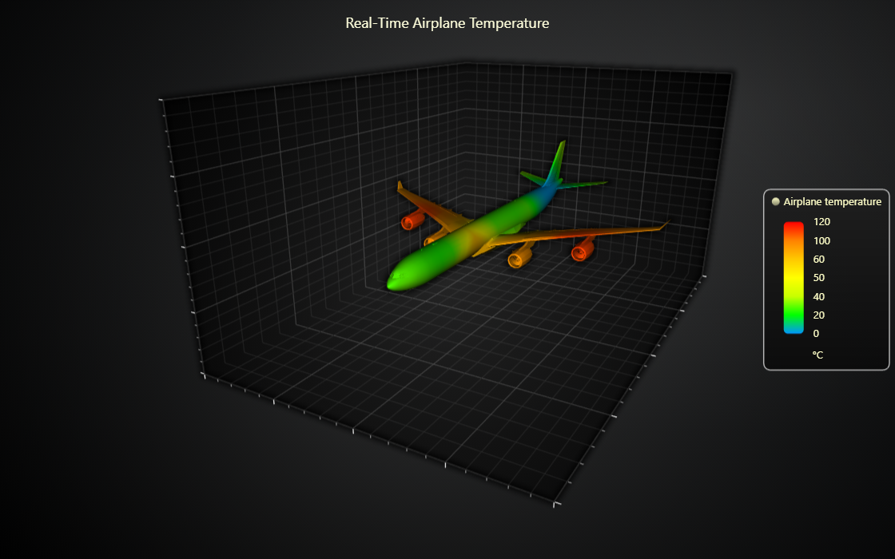

# Dynamic coloring of 3D Mesh Model.

This demo application belongs to the set of examples for LightningChart JS, data visualization library for JavaScript.

LightningChart JS is entirely GPU accelerated and performance optimized charting library for presenting massive amounts of data. It offers an easy way of creating sophisticated and interactive charts and adding them to your website or web application.

The demo can be used as an example or a seed project. Local execution requires the following steps:

-   Make sure that relevant version of [Node.js](https://nodejs.org/en/download/) is installed
-   Open the project folder in a terminal:

          npm install              # fetches dependencies
          npm start                # builds an application and starts the development server

-   The application is available at _http://localhost:8080_ in your browser, webpack-dev-server provides hot reload functionality.

## Description

This example demonstrates how to visualize 3D mesh models with customized coloring using the setVertexValues() method and PalettedFill.

To apply color to your 3D model using PalettedFill, you'll need to set values for each vertex.

First, every vertex of the model is iterated, and a weight for every sensor is calculated for that vertex.

This weight essentially describes how close to the vertex every sensor is.

Then, the sensor values are changed in real-time, and the vertex values are re-interpolated every time they do to update the colors.

This can be achieved by calling the setVertexValues() method, which accepts a callback function as an argument. This callback function should take a vertex as a parameter and return an array of colored values based on your criteria.

## API Links

* [Mesh Model]
* [Vertex Values]

## Support

If you notice an error in the example code, please open an issue on [GitHub][0] repository of the entire example.

Official [API documentation][1] can be found on [LightningChart][2] website.

If the docs and other materials do not solve your problem as well as implementation help is needed, ask on [StackOverflow][3] (tagged lightningchart).

If you think you found a bug in the LightningChart JavaScript library, please contact sales@lightningchart.com.

Direct developer email support can be purchased through a [Support Plan][4] or by contacting sales@lightningchart.com.

[0]: https://github.com/Arction/
[1]: https://lightningchart.com/lightningchart-js-api-documentation/
[2]: https://lightningchart.com
[3]: https://stackoverflow.com/questions/tagged/lightningchart
[4]: https://lightningchart.com/support-services/

© LightningChart Ltd 2009-2022. All rights reserved.

[Mesh Model]: https://lightningchart.com/js-charts/api-documentation/v7.0.1/classes/MeshModel3D.html
[Vertex Values]: https://lightningchart.com/js-charts/api-documentation/v7.0.1/classes/MeshModel3D.html#setVertexValues

